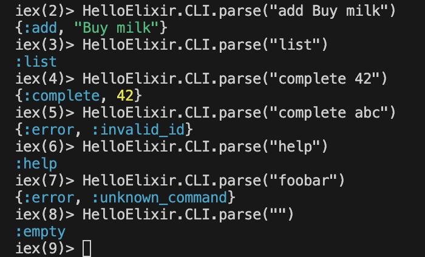

# 1. WHAT ARE WE DOING?

We're building a CLI command parser - takes raw user input like "add Buy milk" and converts it to structured data the app can understand.

```elixir
Input:  "add Buy milk"
Output: {:add, "Buy milk"}  ← App now knows "user wants to add task"
```


# 2. Actual Code

```elixir
defmodule HelloElixir.CLI do
  @moduledoc """
  Command line interface for the Task Manager application.
  """

  # Public Entry point for the CLI
  def parse(line) when is_binary(line) do
    line
    |> String.trim()
    |> String.split(~r/\s+/, parts: 2)
    |> do_parse()
  end

  # Private pattern-matching handlers


  # "add Some title
  defp do_parse(["add", title]) when byte_size(title) > 0 do
    {:add, title}
  end

  # "list"
  defp do_parse(["list"]) do
    :list
  end

  # "complete 3"
  defp do_parse(["complete", id_str]) do
    case Integer.parse(id_str) do
      {id, ""} -> {:complete, id}
      _ -> {:error, :invalid_id}
    end
  end

  # "help"
  defp do_parse(["help"]) do
    :help
  end

  # Empty Input
  defp do_parse([""]) do
    :empty
  end

  # Anything Else
  defp do_parse(_other) do
    {:error, :unknown_command}
  end
end

```

# 3. WHAT ARE WE RETURNING? TUPLES!

```elixir
{:add, "Buy milk"}     = Tagged tuple (like {action, data})
:list                  = Atom (simple command)
{:error, :invalid_id}  = Error tuple (standard pattern)
```

Why tuples? Elixir never throws exceptions - always returns {:ok, value} or {:error, reason}.

Node.js equivalent:

```js
{ action: "add", title: "Buy milk" }  // OR
{ type: "error", reason: "invalid_id" }
```

# 4. {:add, title} = Atom Tag + Data

```text
:add       = Atom (unique identifier, like string enum)
"Buy milk" = The actual data
```

Like tagged unions:

```ts
type Command = 
  | { type: "add", title: string }
  | { type: "list" }
  | { type: "error", reason: string }
```

# 5. def parse(line) when is_binary(line) do

```elixir
def parse(line)          = Function name + param
when is_binary(line)    = GUARD CLAUSE (only run if line is string)
do ... end              = Function body
```

Node equivalent:

```js
function parse(line) {
  if (typeof line !== 'string') return null;
  // ...
}
```

Test it:

```elixir
TaskManager.CLI.parse("hello")     # Works ✅
TaskManager.CLI.parse(123)         # Doesn't match (nil)
```

# 6. HOW IT WORKS (Magic Step-by-Step)

```text
Input: "add Buy milk"

1. String.trim()    → "add Buy milk"
2. String.split()   → ["add", "Buy milk"] 
3. do_parse/1       → Matches ["add", title] pattern ✅
4. Returns          → {:add, "Buy milk"}
```



# Node.js Equivalent (for comparison)

```js
function parseCLI(line) {
  const parts = line.trim().split(/\s+/);
  
  if (parts[0] === 'add' && parts[1]) {
    return { action: 'add', title: parts[1] };
  }
  
  if (parts[0] === 'list') {
    return { action: 'list' };
  }
  
  // ... 10+ if statements
  return { error: 'unknown_command' };
}
```

# HOW TO USE THE TUPLES - REAL EXAMPLE 🚀
The tuples are "instructions" for the next layer. Here's how they flow:

User types: "add Buy milk"
    ↓
CLI.parse("add Buy milk") → {:add, "Buy milk"}
    ↓
TaskManager.add("Buy milk") ← Takes the tuple data
    ↓
Returns: %Task{id: 1, title: "Buy milk"}
